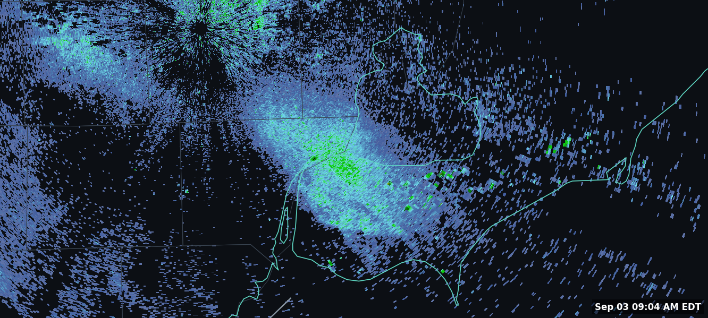

# NEXRAD Radar Loop

A self-hosted Home Assistant add-on that renders a live, looping NEXRAD weather
radar image — base reflectivity plus storm-track forecast lines and live
lightning strikes, with county/state/province map context — for **any** US
radar site and location. Built to sit in a Lovelace `iframe` card on a
kiosk-style dashboard.

It's a from-scratch renderer, not a hotlinked embed: it polls NOAA's public
Open Data feed directly and draws the image itself with
[MetPy](https://unidata.github.io/MetPy/), [Cartopy](https://scitools.org.uk/cartopy/),
and Matplotlib.

## What it does

- Polls the public `unidata-nexrad-level3` S3 bucket (NOAA's Open Data
  Dissemination program — no API key, no account) every 60 seconds for the
  latest base reflectivity (N0B) and storm-track (NST) products for your
  configured radar site.
- Renders each new scan as a map-projected image: reflectivity data, US
  county lines, US/Canada state/province borders, coastlines, and a solid
  white line per storm cell showing its forecast track.
- Keeps a rolling ~1-hour buffer (12 frames) as a looping animated GIF, plus
  a tiny auto-refreshing HTML page, served on port 8600.
- Imprints the radar's own scan time (not wall-clock time) on each frame.
- Optionally overlays live lightning strikes (fading `x` markers, most recent
  15 minutes) if the [Blitzortung](https://github.com/mrk-its/homeassistant-blitzortung)
  HACS integration is installed — see below.

## Installation

1. Add this repository to your Home Assistant instance: **Settings → Add-ons
   → Add-on Store → ⋮ → Repositories**, paste this repo's URL.
2. Find **NEXRAD Radar Loop** under the newly-added repository and install it.
3. Open its **Configuration** tab and set your options (see below) before
   starting it.
4. Start the add-on, then point a Lovelace `iframe` card at
   `http://<your-ha-host>:8600/`.

## Configuration options

| Option | Type | Default | Description |
|---|---|---|---|
| `radar_site` | string | `DTX` | Your nearest NEXRAD site's 3-letter ID (drop the leading `K`) — e.g. Detroit/Pontiac, MI is `KDTX` → `DTX`. Find yours on the [NWS radar site map](https://www.weather.gov/jetstream/doppler_radar). |
| `home_latitude` | float | `0.0` | Latitude to center the local view on. **Required** — leave at `0.0` and the render centers on the equator. |
| `home_longitude` | float | `0.0` | Longitude to center the local view on. **Required.** |
| `local_width_km` | float | `220` | Width of the local view in kilometers (height is derived from your dashboard card's aspect ratio, hardcoded to 1342:604 — adjust `CARD_ASPECT` in `app/fetch_render.py` if yours differs). |
| `timezone` | string | `America/New_York` | [IANA timezone name](https://en.wikipedia.org/wiki/List_of_tz_database_time_zones) for the timestamp imprinted on each frame. |

**Center on your home, not the radar tower.** Radar sites have significant
near-field ground clutter right at the tower — centering the view there
instead of your actual location will mostly show clutter, not real weather.

## Lightning strikes (optional)

If you have the [Blitzortung](https://github.com/mrk-its/homeassistant-blitzortung)
HACS integration installed and configured (it creates
`geo_location.lightning_strike_*` entities for nearby strikes), this add-on
draws them automatically — no extra configuration needed. It reads those
entities through Home Assistant's own API via the `homeassistant_api: true`
add-on option, which makes Supervisor inject credentials automatically; you
never need to create or paste in an access token yourself. If Blitzortung
isn't installed, this silently does nothing — no errors, just no strikes
drawn.

## Known limitations

- **Storm-track overlay only draws the forecast line**, not a marker/label for
  the storm ID — this was a deliberate styling choice in the original build,
  not a technical limit. Past-track history is also intentionally not drawn.
  Both are easy to re-enable by editing `render_frame()` in
  `app/fetch_render.py` if you'd prefer them.
- **Dual-polarization products** (differential reflectivity, correlation
  coefficient) are not rendered — NOAA doesn't publish these as ready
  tile/mosaic services, only as raw files requiring your own decode pipeline.
- Single-architecture (`amd64`) build only.

## Credits

Radar data: [NOAA Open Data Dissemination program](https://www.noaa.gov/nodd),
served via the public `unidata-nexrad-level3` AWS S3 bucket. Rendering:
[MetPy](https://unidata.github.io/MetPy/) (Unidata) and
[Cartopy](https://scitools.org.uk/cartopy/) (SciTools), both BSD-licensed.
Map boundary data: [Natural Earth](https://www.naturalearthdata.com/) (public
domain) and MetPy's bundled US Census county shapefile.
